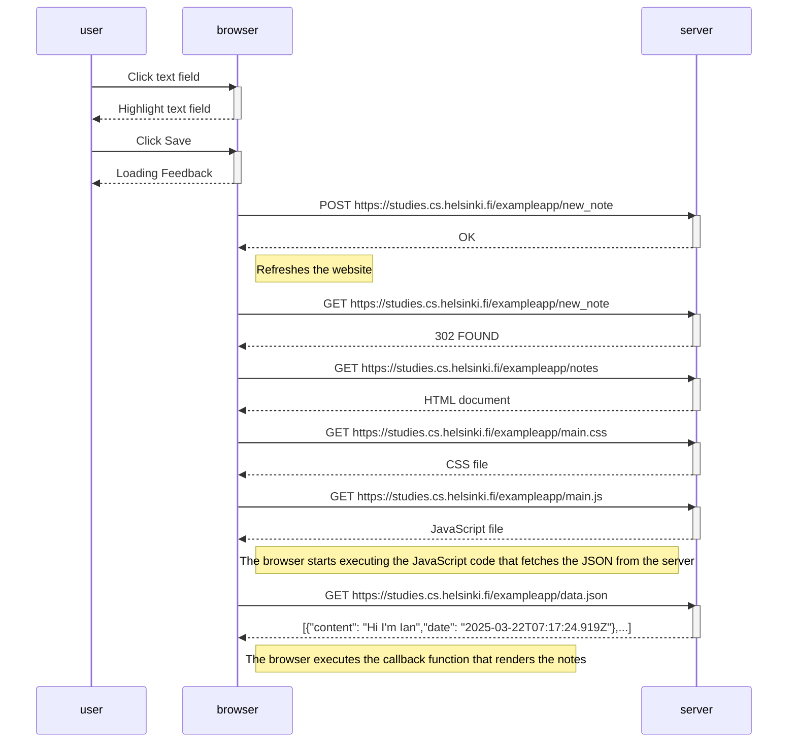

```mermaid
sequenceDiagram
  participant user
  participant browser
  participant server

  user->>browser: Click text field
  activate browser
  browser-->>user: Highlight text field
  deactivate browser

  user->>browser: Click Save
  activate browser
  browser-->>user: Loading Feedback
  deactivate browser

  browser->>server: POST https://studies.cs.helsinki.fi/exampleapp/new_note
  activate server
  server-->>browser: OK
  deactivate server

  Note right of browser: Refreshes the website

  browser->>server: GET https://studies.cs.helsinki.fi/exampleapp/new_note
  activate server
  server-->>browser: 302 FOUND
  deactivate server

  browser->>server: GET https://studies.cs.helsinki.fi/exampleapp/notes
  activate server
  server-->>browser: HTML document
  deactivate server

  browser->>server: GET https://studies.cs.helsinki.fi/exampleapp/main.css
  activate server
  server-->>browser: CSS file
  deactivate server

  browser->>server: GET https://studies.cs.helsinki.fi/exampleapp/main.js
  activate server
  server-->>browser: JavaScript file
  deactivate server

  Note right of browser: The browser starts executing the JavaScript code that fetches the JSON from the server

  browser->>server: GET https://studies.cs.helsinki.fi/exampleapp/data.json
  activate server
  server-->>browser: [{"content": "Hi I'm Ian","date": "2025-03-22T07:17:24.919Z"},...]
  deactivate server

  Note right of browser: The browser executes the callback function that renders the notes
```
